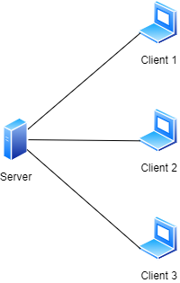

# Client-Server App

A simple client-server console application that allows many clients to connect to a single server using
multi-threading and network sockets.
The application also demonstrates using cryptography (and a set of public and private keys) to encode messages
for transport, and a MySQL database for validating users.
The app then allows logged-in users to performs various tasks, which have been abstracted using a simple 'Task'
interface.

1. With your MySQL server running, create a new database using [this script](./src/main/resources/create-database.sql).
1. Start a new [Server](./src/main/java/com/example/Server.java) using your terminal or IDE.
1. Start any number of [Client](./src/main/java/com/example/Client.java) instances and login using any of the users in your database.  
    The following usernames and passwords are the default ones given in the script above:
    | username | password  |
    |----------|-----------|
    | Adam     | adam.123  |
    | Brian    | brian.123 |
    | Chris    | chris.123 |
    | John     | john.123  |
    | Peter    | peter.123 |

You should now have multiple client instances connected to the same single server instance like shown below.

This is just a simple demonstration project, but please be sure to submit a pull request if you have any improvements you would like to contribute to make it better 👍 